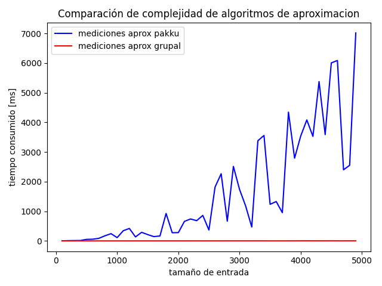
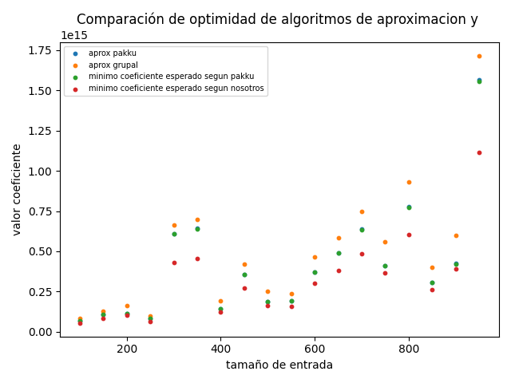

\newpage
# Objetivo
En el presente trabajo se llevará a cabo el desarrollo y análisis de algoritmos de Backtracking y Programación Lineal para resolver un problema NP-Completo, así como el análisis de posibles aproximaciones. También se realizará una demostración de la clase de complejidad del mismo.

# Análisis del problema
Se define la versión de decisión del problema de la Tribu del Agua de la siguiente manera:

Dada una secuencia de $n$ fuerzas/habilidades/poderes de maestros de agua $x_1,x_2 \ldots x_n$, y dos números $k$ y $B$, definir si existe una partición en $k$ subgrupos $S_1, S_2, \ldots, S_k$ tal que:

$$
\sum_{i=1}^{k} \left({\sum_{x_j\in S_i}x_j}\right)^2 \le B
$$

## El problema es NP-Completo
El problema de la Tribu del Agua (a partir de ahora TA) es NP-Completo si cumple con las siguientes condiciones:

1. [El problema se encuentra en NP](#el-problema-se-encuentra-en-np).
2. [Cualquier problema NP-Completo puede reducirse polinomialmente a este problema](#cualquier-problema-np-completo-puede-reducirse-polinomialmente-a-este-problema).

### El problema se encuentra en NP
Para demostrar que el problema de la Tribu del Agua está en NP, basta con implementar un certificador eficiente de soluciones del mismo que sea de complejidad polinomial en función al tamaño de la entrada. En otras palabras, debemos implementar un algoritmo que, dado un conjunto de $n$ maestros $M$ cada uno con su poder $x_i$, una cantidad de grupos $k$, un número $B$, y $l$ conjuntos $S_1, S_2, \ldots, S_l$, defina si esos conjuntos son una solución al problema en cuestión.

$S$ es solución si cumple con las siguientes condiciones:
\newpage

+ $S_1, S_2, \ldots, S_n$ es partición de $M$
+ $l = k$
+ $\sum_{1 \le i \le k}\left({\sum_{x_j\in S_i}x_j}\right)^2 \le B$

A continuación se presenta la implementación de dicho algoritmo en Python:

```python
def verificar_solucion(M: set, k: int, B: int, S: list[set]) -> bool:
  # S = [S_1, S_2, ... S_l]  |M| = n
  copia = M.copy()
  if len(S) != k:
    return False

  # O(k) * O(n/k) = O(n)
  for S_i in S:  # k iteraciones
    for maestro in S_i:  # n/k iteraciones en promedio
      if maestro not in M:  # O(1)
        return False
      copia.discard(maestro)  # O(1)

  if len(copia) != 0:
    return False

  return obtener_suma(S) <= B  # O(k) * O(n/k) = O(n)
  
def obtener_suma(S):
  suma_total = 0
  for S_i in S:   # O(k)
      suma_total += cuadrado_suma_grupo(S_i)
  return suma_total

def cuadrado_suma_grupo(S_i):
  suma = 0
  for maestro in S_i:   # O(n/k)
      suma += maestro[PODER]
  return suma ** 2
```

La complejidad temporal del verificador es $\mathcal{O}(n)$ + $\mathcal{O}(n) \approx \mathcal{O}(n)$ en función de la entrada. Por lo tanto, TA $\in$ NP.

### Cualquier problema NP-Completo puede reducirse polinomialmente a este problema

Para comprobar la segunda condición se plantea reducir el problema de Subset Sum, el cual se sabe que es NP-Completo, al problema en cuestión.

Se define el problema de Subset Sum (SS) de la siguiente manera: 

Dado un conjunto $S$ de $n$ enteros positivos y un número $T$, decidir si existe un subconjunto de $S$ tal que la suma de los elementos del mismo es $T$.

### Reducción SS a TA
+ Se definen $n$ maestros, uno por cada elemento de $S$, con un poder $x_i$ equivalente al valor del mismo (se referirá a este conjunto de maestros como $S$ a lo largo de la reducción).
+ Se agregan dos maestros adicionales: 
  + $z_1 = sum(S)$ 
  + $z_2 = 2T$
 
  El poder total de todos los maestros ahora equivale a $m = 2(sum(S) + T)$.
+ Se llama a TA con:
  + $M = \{S \cup z_1 \cup z_2\}$
  + $k = 2$   
  + $B = 2(sum(S) + T)^2$ 
 
#### Si hay solución a TA:
Para empezar vale la pena observar que, como se busca que los grupos queden lo más balanceados posible, la solución ideal es aquella en donde se logran formar $k$ grupos con sumas equivalentes de los elementos que los conforman. Entonces, siendo $m$ el poder total de los maestros, cada grupo tendrá $m/k$ poder acumulado.

Para esta reducción, $m = 2(sum(S) + T)$ y $k = 2$, por lo que cada grupo deberá tener $sum(S) + T$ de poder total en el caso ideal. Desarrollando el coeficiente para este escenario:

$$
\sum_{i=1}^{k} {\left({\sum_{x_j\in S_i}x_j}\right)}^2 = sum(S_1)^2 + sum(S_2)^2 =
$$
$$ 
= (sum(S) + T)^2 + (sum(S) + T)^2 = 2(sum(S) + T)^2
$$

Se puede apreciar que el coeficiente para el mejor caso coincide con el $B$ que se le dio al problema, por lo que si existe una solución con un coeficiente de a lo sumo $B$, existe una forma de repartir los maestros en dos grupos tal que cada grupo suma $sum(S) + T$.

Además, $z_1$ y $z_2$ no pueden estar en el mismo grupo porque juntos suman $sum(S) + 2T$. Si un grupo $S_1$ contiene al maestro $z_1$, necesita un subconjunto de $S$ que sume $T$, i.e. **necesita a la solución de SS**. Por otra parte, si el grupo contiene a $z_2$, necesita de un subconjunto de maestros cuyo poder total sume $sum(S) - T$. Este subconjunto se obtiene de aquellos elementos que no se hayan usado en la solución de SS. 

Por lo tanto, si se encuentra solución a TA con $B = 2(sum(S) + T)^2$, existe solución a SS. Caso contrario, implica que no hay subconjunto de $S$ que sume exactamente T y no existe solución a SS.

#### Si hay solución a SS:
Suponiendo que existe una solución $S'$ tal que $sum(S') = T$, entonces $sum(S' \cup z1) = sum(S-S'\cup z2)$. Por consiguiente, es posible dividir $S$ en dos grupos de mismo poder $S_1 = \{S', z_1\}$ y $S_2 = \{S-S', z_2\}$, que es la mejor solución a TA. Desarrollando el coeficiente:

$$
\sum_{i=1}^{k} {\left({\sum_{x_j\in S_i}x_j}\right)}^2 = sum(S_1)^2 + sum(S_2)^2 =
$$
$$
= (T + sum(S))^2 + (sum(S)-T + 2T)^2 =
$$
$$
= (sum(S) + T)^2 + (sum(S) + T)^2 = 2(sum(S) + T)^2
$$

Por lo tanto, existe una partición de maestros tal que:

$$
\sum_{i=1}^{k} {\left({\sum_{x_j\in S_i}x_j}\right)}^2 \le 2(T + sum(S))^2
$$

Finalmente, SS $\le_{p}$ TA y como TA es NP también es NP-Completo.
 
# Algoritmos y complejidad
Se proponen varios algoritmos siguiendo distintas técnicas de diseño, siendo algunos de ellos óptimos y otros aproximaciones. Para todos los siguientes casos se tiene en cuenta la versión de optimización de TA.

## Backtracking
El algoritmo implementado es el siguiente:

0. Se calcula una aproximación con un algoritmo Greedy, para que sirva como poda inicial.
1. Si la asignación actual cubre a todos los maestros, se devuelve la mejor (la de menor coeficiente) entre esta y la calculada anteriormente.
2. Si todavía no se terminaron de repartir los maestros pero el coeficiente parcial actual ya supera al mejor coeficiente encontrado hasta el momento, se retrocede en la llamada recursiva y se vuelve al paso 3.
3. Se elige un grupo y se asigna al maestro actual al mismo.
4. Se llama recursivamente al paso 1 con el maestro siguiente y la mejor solución calculada hasta el momento. 
5. Cuando sale del _for_ es porque ya se evaluaron todas las asignaciones posibles para el maestro actual, y se devuelve la óptima.

#### Código
```python
# Código en bt.py
def backtracking(maestros, k):
    solucion_greedy = aprox_pakku(maestros, k)  # Solucion aproximada
    suma_greedy = obtener_suma(solucion_greedy)
    solucion = backtracking_rec(maestros, [[] for _ in range(k)], 0,
                    solucion_greedy, suma_greedy)
    return solucion

def backtracking_rec(maestros, grupos, m, solucion_anterior, suma_anterior):
    if m == len(maestros):  # Se le asigno grupo a todos los maestros
        suma_actual = obtener_suma(grupos)
        if suma_actual < suma_anterior:
            return deepcopy(grupos)
        return solucion_anterior
    
    if obtener_suma(grupos) >= suma_anterior: 
        # No se termino de asignar grupo a todos los maestros pero 
        # la suma ya es mayor al optimo actual
        return solucion_anterior
    
    optimo_actual = solucion_anterior
    suma_opt = suma_anterior
    
    for grupo in grupos:
        grupo.append(maestros[m])
        optimo_actual = backtracking_rec(maestros, grupos, m + 1,
                              optimo_actual, suma_opt)
        suma_opt = obtener_suma(optimo_actual)
        grupo.pop()

    return optimo_actual
```

#### Análisis de complejidad:
El algoritmo, si bien realiza podas de por medio, explora de forma explícita todo el espacio de soluciones buscando la óptima, por lo que la complejidad total resulta ser exponencial.

## Programación Lineal
Se plantean dos modelos distintos y se utiliza la librería _pulp_ de Python para ejecutarlos. El código de ambos se encuentra en _pl.py_.

### Versión óptima
En esta versión se busca resolver el problema original y obtener la solución óptima del mismo.

#### Definición de variables

+ $n$: número de maestros agua.
+ $k$: número de grupos.
+ $x_i$: poder del maestro $i$ (valores positivos).
+ $p_{ij}$: variable binaria que indica si el maestro $i$ está en el grupo $j$ ($p_{ij} = 1$) o no ($p_{ij} = 0$).
+ $Y_{ijw}$: variable booleana, $p_{iw} \land p_{jw}$.
+ $S_i$: cuadrado de la suma de poder de los maestros del grupo $i$.

#### Restricciones

+ Cada maestro $i$ debe ser asignado a un único grupo:

$$
\sum_{j=1}^{k} p_{ij} = 1 \quad \forall i \in \{1, 2, \ldots, n\}
$$

+ $Y_{ijw} = p_{iw} \land p_{jw}$:

$$
2Y_{ijw} \le p_{iw} + p_{jw} \le Y_{ijw} + 1
$$

+ Desarrollo del cuadrado de la suma de poderes de un grupo:
  
$$
S_w = \left({\sum_{i = 1}^{n}x_i\cdot p_{iw}}\right)^2 = \sum_{i = 1}^{n}x_i^2\cdot p_{iw}^2 + 2\left({\sum_{i=1}^{n}\sum_{j = i+1}^{n}x_ix_j\cdot p_{iw}p_{jw}}\right)=
$$
$$
= \sum_{i = 1}^{n}x_i^2\cdot p_{iw} + 2\left({\sum_{i=1}^{n}\sum_{j = i+1}^{n}x_ix_j\cdot Y_{ijw}}\right) \forall w \in \{1, 2, \ldots, k\}
$$

#### Función objetivo

$$
\min \sum_{i=1}^k S_i
$$

### Versión aproximada
A diferencia del caso anterior, esta versión modela una versión aproximada del problema, en cual se busca minimizar la diferencia del grupo con la mayor suma, y el grupo con la menor suma.

#### Definición de variables

+ $n$: número de maestros agua.
+ $k$: número de grupos.
+ $x_i$: poder del maestro $i$ (valores positivos).
+ $p_{ij}$: variable binaria que indica si el maestro $i$ está en el grupo $j$ ($p_{ij} = 1$) o no ($p_{ij} = 0$).
+ $S_j$: suma de poder del grupo $j$.
+ $M$: máxima suma de poder entre todos los grupos.
+ $m$: mínima suma de poder entre todos los grupos.

#### Restricciones

+ Cada maestro $i$ debe ser asignado a un único grupo:
$$
\sum_{j=1}^{k} p_{ij} = 1 \quad \forall i \in \{1, 2, \ldots, n\}
$$

+ La suma de poder del grupo $j$ debe ser igual a la suma de las poder de los maestros asignados a ese grupo:
 
$$
S_j = \sum_{i=1}^{n} p_{ij} \cdot x_i \quad \forall j \in \{1, 2, \ldots, k\}
$$

+ Máxima y mínima suma de poder:

$$
S_j \leq M \quad \forall j \in \{1, 2, \ldots, k\}
$$

$$
S_j \geq m \quad \forall j \in \{1, 2, \ldots, k\}
$$

#### Función objetivo

$$
\min: M - m
$$

#### Análisis de complejidad:
Para ambas versiones, como algunas de las variables en cuestión son binarias, el problema se clasifica como un problema de Programación Lineal Entera (PLE). 

La complejidad de resolver un problema de PLE utilizando el algoritmo _branch-and-bound_ es, en el peor de los casos, exponencial en función del número de variables binarias. Por lo tanto, es $\mathcal{O}(2^{nk})$ lo cual implica que a medida que el número de variables binarias aumenta (mayor cantidad de maestros y/o grupos), el tiempo de cómputo necesario para resolver el problema crece exponencialmente.

## Algoritmos Greedy
### Aproximación de Pakku
Pakku propone el siguiente algoritmo Greedy:

1. Generar los $k$ grupos vacíos: $\mathcal{O}(k)$
2. Ordenar los maestros de mayor a menor según su poder: $\mathcal{O}(n\log n)$
3. Por cada maestro se obtiene el grupo con menor cuadrado de la suma (en $\mathcal{O}(n)$ ) y se lo agrego al mismo: $n\cdot\mathcal{O}(n) = \mathcal{O}(n^2)$

Complejidad temporal: $\mathcal{O}(k) + \mathcal{O}(n\log n) + \mathcal{O}(n^2) \approx \mathcal{O}(n^2)$
en función de los datos de entrada.

#### Código
```python
# Código en greedy.py
def aprox_pakku(maestros, k):
    """Algoritmo Greedy propuesto en el enunciado."""
    # Se forman los k grupos vacios
    grupos = []
    for _ in range(k):
        grupos.append([])

    # Se ordenan los maestros por poder de forma decreciente
    maestros.sort(reverse = True, key = lambda m: m[PODER])

    for maestro in maestros:
        # Se agrega el maestro al grupo de menor suma
        grupo = min(grupos, key=cuadrado_suma_grupo) # O(n)
        grupo.append(maestro)

    return grupos
```

### Aproximación Greedy propuesta
Aprovechando la idea de que el algoritmo en su mejor caso logra repartir los maestros de forma completamente equitativa (tal que cada grupo tenga $\frac{1}{k} \sum x_i$ de poder acumulado), se propone el siguiente algoritmo:

1. Se obtiene el numero $p = \frac{1}{k} \sum x_i$ en $\mathcal{O}(n)$.
2. Se ordenan los maestros de mayor a menor según su poder en $\mathcal{O}(n\log n)$.
3. Se iteran los maestros y se van añadiendo en un mismo grupo hasta que el poder acumulado del mismo alcance o se pase de $p$, continuando con el siguiente grupo cuando eso ocurra. Esto se hace en $\mathcal{O}(n)$.

Complejidad temporal total: $\mathcal{O}(n) + \mathcal{O}(n\log n) + \mathcal{O}(n) \approx \mathcal{O}(n\log n)$ en función de los datos de entrada.

#### Código
```python
# Código en greedy.py
def aprox_propia(maestros, k):
    """Algoritmo Greedy propuesto por nosotros"""
    grupos = []
    nuevo_grupo = []
    poder_acumulado = 0
    poder_ideal = sum(m[PODER] for m in maestros) / k

    # Ordeno los maestros por poder de forma decreciente
    maestros.sort(reverse=True, key = lambda m: m[PODER])

    for maestro in maestros:
        if poder_acumulado > poder_ideal:
            grupos.append(nuevo_grupo)
            nuevo_grupo = []
            poder_acumulado = 0

        nuevo_grupo.append(maestro)
        poder_acumulado += maestro[PODER]
    
    grupos.append(nuevo_grupo)

    return grupos
```

# Mediciones
## Cotas de aproximación
Primero es necesario definir:

- $I$: una instancia cualquiera del problema.
- $z(I)$: una solución óptima para dicha instancia.
- $A(I)$: la solución aproximada.
- $r(A)$: la cota máxima para todas las instancias posibles tal que:
$$
\frac{A(I)}{z(I)} \le r(A)
$$

Con el objetivo de determinar $r(A)$, se generaron múltiples datasets aleatorios con cantidad de maestros $n=1,\ldots,10$ y cantidad de grupos $k=1,\ldots,8$ para llamar tanto al algoritmo de Backtracking (para encontrar la solución óptima) como a los dos algoritmos de aproximación para todas las variaciones posibles de estos $n$ y $k$. 

La idea aquí fue quedarse para cada algoritmo de aproximación con la cota máxima encontrada entre todas las ejecuciones. Las respuestas no determinísticas encontradas fueron (redondeando a 6 decimales):

- Cota aproximación de Pakku: **1.003952**
- Cota aproximación propia: **1.536598**

El código se encuentra en _mediciones.py_.

## Gráficos
Con el fin de comparar el desempeño los algoritmos Greedy propuestos, se realizaron mediciones de tiempo y optimalidad para grandes volúmenes de datos.

### Comparación de tiempo consumido
Se generaron muestras aleatorias de 100 a 5000 maestros en pasos de 100, eligiéndose en cada caso un $k$ válido aleatorio. Por cada tamaño se tomó un tiempo promedio de ejecución por cada algoritmo de aproximación. 


Se puede observar una diferencia notable entre los algoritmos, al punto que el tiempo consumido por el nuestro de complejidad $\mathcal{O}(n\log n)$ queda despreciable al lado del algoritmo de Pakku, de complejidad cuadrática en función de la entrada.

### Comparación de precisión
Se generaron muestras aleatorias de 100 a 1000 elementos en pasos de 50, eligiéndose en cada caso un $k$ válido aleatorio. Por cada muestra se obtuvo el coeficiente calculado mediante ambos algoritmos, y además, a partir de la cota de aproximación obtenida previamente, se graficaron los correspondientes valores estimados del coeficiente óptimo por cada algoritmo.


Se observa que el algoritmo de Pakku logró repartir los maestros de una manera más óptima en todos los casos observados, pues devuelve un coeficiente menor. También se observa que este algoritmo es más preciso, pues no se nota mucha diferencia entre el coeficiente obtenido y el mínimo esperado, a diferencia de nuestro algoritmo donde ocurre lo contrario. 

El código utilizado para la generación de los gráficos se encuentra en  _plot_complejidad.py_ y _plot_coeficiente.py_, respectivamente.

\newpage
# Conclusiones
- El problema de la Tribu del Agua efectivamente se encuentra en NP y es NP-Completo.
- Dada la clase de complejidad del mismo, tanto por Backtracking como con Programación Lineal Entera se obtiene la solución óptima en tiempo exponencial.
- Comenzar con una aproximación Greedy como punto de partida antes de ejecutar el algoritmo de Backtracking le permite hacer una poda y ahorrar iteraciones innecesarias.
- Utilizar Programación Lineal Entera como aproximación no es una buena práctica, dada su característica exponencial.
- El algoritmo de aproximación propuesto provee soluciones más lejanas a la óptima en comparación al de Pakku, pero en términos de complejidad temporal se ejecuta mucho más rápido.
